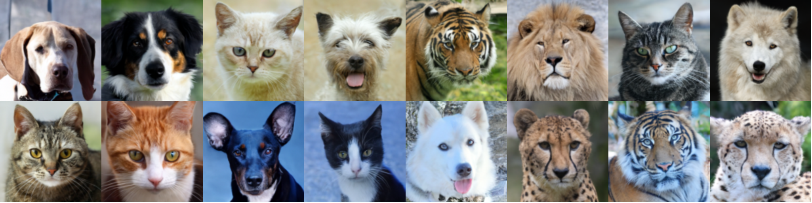

# <p align="center">Phase Space Langevin Diffusion <br><br> ICCV'23 (Oral Presentation)</p>

<div align="center">
  <a href="https://kpandey008.github.io/" target="_blank">Kushagra&nbsp;Pandey</a> &emsp; <b>&middot;</b> &emsp;
  <a href="https://www.stephanmandt.com" target="_blank">Stephan&nbsp;Mandt</a> 
</div>
<br>

Official Implementation of the paper: <a href='https://openaccess.thecvf.com/content/ICCV2023/papers/Pandey_A_Complete_Recipe_for_Diffusion_Generative_Models_ICCV_2023_paper.pdf'>A Complete Recipe for Diffusion Generative Models </a>

## Overview
<center>

</center>

We propose a complete recipe for constructing novel diffusion processes which are guaranteed to converge to a specified stationary distribution. This serves two benefits: 
<ul>
<li>Firstly, a principled parameterization to construct diffusion models can allow for construction of more flexible processes which do not necessarily rely on physical intuition (like CLD)</li>
<li>Secondly, given a diffusion process, our parameterization can validate if the process converges to a specified stationary distribution.</li>
</ul>

To instantiate this recipe, we propose a new diffusion model: <i>Phase Space Langevin Diffusion (PSLD)</i> which outperforms diffusion models like VP-SDE and CLD, and achieves excellent sample quality on standard image synthesis benchmarks like CIFAR-10 (FID:2.10) and CelebA-64 (FID: 2.01). PSLD also supports classifier-(free) guidance out of the box like other diffusion models.

## Code Overview

This repo uses [PyTorch Lightning](https://www.pytorchlightning.ai/) for training and [Hydra](https://hydra.cc/docs/intro/) for config management so basic familiarity with both these tools is expected. Please clone the repo with `PSLD` as the working directory for any downstream tasks like setting up the dependencies, training and inference.

## Dependency Setup

We use `pipenv` for a project-level dependency management. Simply [install](https://pipenv.pypa.io/en/latest/#install-pipenv-today) `pipenv` and run the following command:

```
pipenv install
```

## Config Management
We  manage hydra configurations separately for each benchmark/dataset used in this work. All configs are present in the `main/configs` directory. This directory has subfolders named according to the dataset where each subfolder contains the corresponding config associated with a specific diffusion models.

<!-- ## Training
Please refer to the scripts provided in the table corresponding to some training tasks possible using the code.

|          **Task**          	|      **Reference**      	|
|:--------------------------:	|:-----------------------:	|
|  Training First stage VAE  	|  `scripts/train_ae.sh`  	|
| Training Second stage DDPM 	| `scripts/train_ddpm.sh` 	|

## Inference

Please refer to the scripts provided in the table corresponding to some inference tasks possible using the code.

|                          **Task**                         	|         **Reference**         	|
|:---------------------------------------------------------:	|:-----------------------------:	|
|            Sample/Reconstruct from Baseline VAE           	|      `scripts/test_ae.sh`     	|
|                   Sample from DiffuseVAE                  	|     `scripts/test_ddpm.sh`    	|
|          Generate reconstructions from DiffuseVAE         	| `scripts/test_recons_ddpm.sh` 	|
| Interpolate in the VAE/DDPM latent space using DiffuseVAE 	|    `scripts/interpolate.sh`   	|

For computing the evaluation metrics (FID, IS etc.), we use the [torch-fidelity](https://github.com/toshas/torch-fidelity) package. See `scripts/fid.sh` for some sample usage examples.
 -->

## Training and Evaluation

We include a sample training and inference script for CIFAR-10. We include all scripts used in this work in the directory `/scripts_psld/`.

- Training a PSLD model on CIFAR-10:

```shell script
python main/train_sde.py +dataset=cifar10/cifar10_psld \
                     dataset.diffusion.data.root=\'/path/to/cifar10/\' \
                     dataset.diffusion.data.name='cifar10' \
                     dataset.diffusion.data.norm=True \
                     dataset.diffusion.data.hflip=True \
                     dataset.diffusion.model.score_fn.in_ch=6 \
                     dataset.diffusion.model.score_fn.out_ch=6 \
                     dataset.diffusion.model.score_fn.nf=128 \
                     dataset.diffusion.model.score_fn.ch_mult=[2,2,2] \
                     dataset.diffusion.model.score_fn.num_res_blocks=8 \
                     dataset.diffusion.model.score_fn.attn_resolutions=[16] \
                     dataset.diffusion.model.score_fn.dropout=0.15 \
                     dataset.diffusion.model.score_fn.progressive_input='residual' \
                     dataset.diffusion.model.score_fn.fir=True \
                     dataset.diffusion.model.score_fn.embedding_type='fourier' \
                     dataset.diffusion.model.sde.beta_min=8.0 \
                     dataset.diffusion.model.sde.beta_max=8.0 \
                     dataset.diffusion.model.sde.decomp_mode='lower' \
                     dataset.diffusion.model.sde.nu=4.01 \
                     dataset.diffusion.model.sde.gamma=0.01 \
                     dataset.diffusion.model.sde.kappa=0.04 \
                     dataset.diffusion.training.seed=0 \
                     dataset.diffusion.training.chkpt_interval=50 \
                     dataset.diffusion.training.mode='hsm' \
                     dataset.diffusion.training.fp16=False \
                     dataset.diffusion.training.use_ema=True \
                     dataset.diffusion.training.batch_size=16 \
                     dataset.diffusion.training.epochs=2500 \
                     dataset.diffusion.training.accelerator='gpu' \
                     dataset.diffusion.training.devices=8 \
                     dataset.diffusion.training.results_dir=\'/path/to/logdir/' \
                     dataset.diffusion.training.workers=1
```

- Generating CIFAR-10 samples from the PSLD model

```shell script
python main/eval/sample.py +dataset=cifar10/cifar10_psld \
                     dataset.diffusion.model.score_fn.in_ch=6 \
                     dataset.diffusion.model.score_fn.out_ch=6 \
                     dataset.diffusion.model.score_fn.nf=128 \
                     dataset.diffusion.model.score_fn.ch_mult=[2,2,2] \
                     dataset.diffusion.model.score_fn.num_res_blocks=8 \
                     dataset.diffusion.model.score_fn.attn_resolutions=[16] \
                     dataset.diffusion.model.score_fn.dropout=0.15 \
                     dataset.diffusion.model.score_fn.progressive_input='residual' \
                     dataset.diffusion.model.score_fn.fir=True \
                     dataset.diffusion.model.score_fn.embedding_type='fourier' \
                     dataset.diffusion.model.sde.beta_min=8.0 \
                     dataset.diffusion.model.sde.beta_max=8.0 \
                     dataset.diffusion.model.sde.nu=4.01 \
                     dataset.diffusion.model.sde.gamma=0.01 \
                     dataset.diffusion.model.sde.kappa=0.04 \
                     dataset.diffusion.model.sde.decomp_mode='lower' \
                     dataset.diffusion.evaluation.seed=0 \
                     dataset.diffusion.evaluation.sample_prefix='some_prefix_for_sample_names' \
                     dataset.diffusion.evaluation.devices=8 \
                     dataset.diffusion.evaluation.save_path=\'/path/to/generated/samples/\' \
                     dataset.diffusion.evaluation.batch_size=16 \
                     dataset.diffusion.evaluation.stride_type='uniform' \
                     dataset.diffusion.evaluation.sample_from='target' \
                     dataset.diffusion.evaluation.workers=1 \
                     dataset.diffusion.evaluation.chkpt_path=\'/path/to/pretrained/chkpt.ckpt\' \
                     dataset.diffusion.evaluation.sampler.name="em_sde" \
                     dataset.diffusion.evaluation.n_samples=50000 \
                     dataset.diffusion.evaluation.n_discrete_steps=50 \
                     dataset.diffusion.evaluation.path_prefix="50"
```
We evaluate sample quality using FID scores. We compute FID scores using the `torch-fidelity` package. 

## Pretrained Checkpoints
Pre-trained PSLD checkpoints can be found [here](https://personalmicrosoftsoftware-my.sharepoint.com/:f:/g/personal/pandeyk1_personalmicrosoftsoftware_uci_edu/EhehC1yAF1pKv1Vp2rZpMTsBG9v1dyjmvmGzkJSWkjPsfQ?e=fSTVao)

## Citation
If you find the code useful for your research, please consider citing our ICCV'23 paper:

```bib
@InProceedings{Pandey_2023_ICCV,
    author    = {Pandey, Kushagra and Mandt, Stephan},
    title     = {A Complete Recipe for Diffusion Generative Models},
    booktitle = {Proceedings of the IEEE/CVF International Conference on Computer Vision (ICCV)},
    month     = {October},
    year      = {2023},
    pages     = {4261-4272}
}
```

## License
See the LICENSE file.
